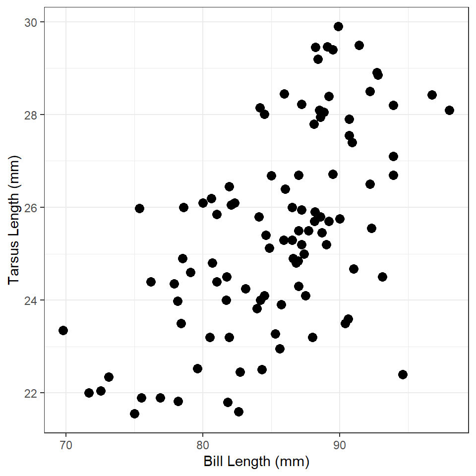
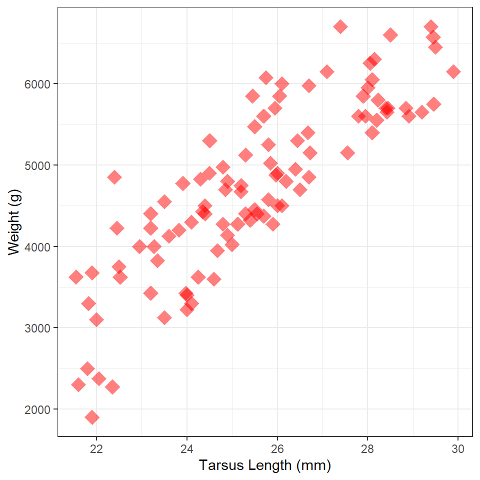

----

## Background

Dr. Jim Paruk studied the morphology of Common Loons (*Gavia immer*), primarily their bills, from a wide variety of locations in North America. These data are in [Loon1.csv](https://raw.githubusercontent.com/droglenc/NCData/master/Loon1.csv), with information about these data in [this metadata file](https://raw.githubusercontent.com/droglenc/NCData/master/Loon1_meta.txt). Download these data (from the link in the previous sentence), load them into R, and examine their structure. [*How load a CSV file into RStudio is [described in this video](https://vimeo.com/144035138), for which the password is "NCStats" (without the quotes).*]

## Tarsus Length vs. Bill Length
Construct `ggplot2` code to match the graph below (as closely as you can).

## Weight vs Tarsus Length
Construct `ggplot2` code to match the graph below (as closely as you can). [*HINT: The graphic at [the bottom of this page](https://ggplot2.tidyverse.org/reference/scale_shape.html#examples) might be useful.*]

