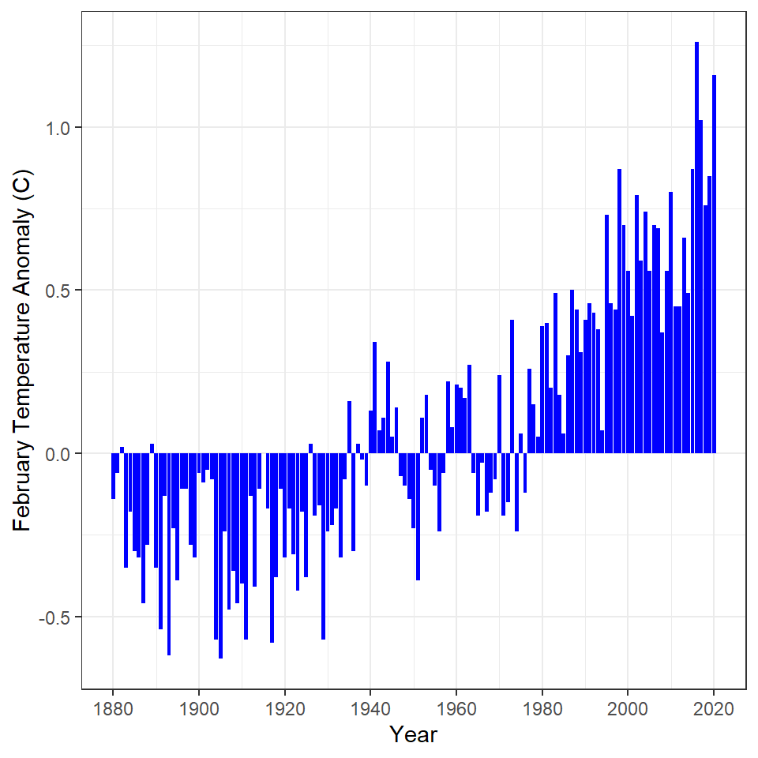

----

## Background

The National Oceanic and Atmpospheric Administration (NOAA) maintains a database of global land and sea temperatures. The data can be accessed from their [Climate at a Glance website](https://www.ncdc.noaa.gov/cag/global/time-series). Their defaut settings show the *global* temperature anomaly (difference from a long-term average) for *February*. These data can be downloaded from their website with the following code.


```r
gt <- read.csv("https://www.ncdc.noaa.gov/cag/global/time-series/globe/land_ocean/1/2/1880-2020/data.csv",skip=4)
```


## Annual Temperatue Anomaly 1
Construct `ggplot2` code to match the graph below (as closely as you can).


## Annual Temperatue Anomaly 2
Construct `ggplot2` code to match the graph below (as closely as you can).


## BONUS -- Annual Temperatue Anomaly 3
Construct `ggplot2` code to match the graph below (as closely as you can).


