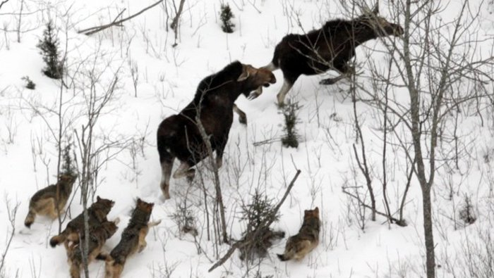

```{r setup, include = FALSE}
knitr::opts_chunk$set(fig.width=6,fig.height=6,out.width="100%",message=FALSE,warning=FALSE,comment="",cache=FALSE,fig.retina=3)
library(flipbookr)
library(tidyverse)
options(width=120,show.signif.stars=FALSE)
```


# Background

- Estimated counts of Gray Wolf (*Canis lupus*) and Moose (*Alces alces*) from Isle Royale.


```{r, echo=FALSE, out.width="500px"}

```
<font size="1">Credit: <a href="https://www.mtu.edu/news/stories/2012/march/wolf-population-isle-royale-drops-lowest-has-ever-been.html">Michigan Technological University</a></font>

---

# Background

- Downloaded 'Data_wolves_moose_Isle_Royale_June2019.xlsx' Excel file from [Wolves & Moose of Isle Royale](https://isleroyalewolf.org/data/data/home.html).

--
- Data in '1. population level data' sheet of Excel data file loaded into `irmw` data.frame.
  - Skipped first line of sheet because it had unneeded headers.

```{r load1}
fn <- "Data_wolves_moose_Isle_Royale_June2019.xlsx"
irmw <- readxl::read_excel(fn,sheet="1. population level data",skip=1)
```


---

# Background

- Selected only five variables.
- Renamed two variables with space in names (and long).
- Changed categorical data from numbers to words and converted to a factor.

```{r load2}
irmw %<>%
  select(year,wolves,moose,`Jan-Feb (temp, F)`,
         `ice bridges (0=none, 1 = present)`) %>%
  rename(winter_temp=`Jan-Feb (temp, F)`,
         ice_bridges=`ice bridges (0=none, 1 = present)`) %>%
  mutate(ice_bridges=plyr::mapvalues(ice_bridges,from=c(0,1),to=c("no","yes")),
         ice_bridges=factor(ice_bridges))
head(irmw)
```

---

# Background

```{r}
head(irmw)
```

- Variables are:
  - **year**: Calendar year of observation.
  - **wolves**: Estimated number of wolves present that year.
  - **moose**: Estimated number of moose present that year.
  - **winter_temp**: Mean January-February temperature (<sup>o</sup>F).
  - **ice_bridges**: Whether or not an ice bridge formed to the mainland.

---

# ggplot Initial Requirements

```{r baseplot1, eval=FALSE}
p <- ggplot(data=irmw,
            mapping=aes(x=year,y=wolves))
```

- ggplots begin with `ggplot()`.

--
  - *Usually* has `data=` that declares a *global* data.frame for use.

--
  - *Usually* has `mapping=` that declares how 'aesthetics' are mapped to 'variables'.

--
    - Aesthetics are wrapped in `aes()` and *usually* require variables mapped to `x` and `y`.


--
- Result is assigned to an object (here `p`).

--
  - Items ('layers') can be added to this base plot.

--
  - Plot will not be shown until object is run (i.e., type `p`).

---

```{r baseplot2, include=FALSE}
<<baseplot1>>
```

`r chunk_reveal("baseplot1",break_type=1,left_assign=TRUE)`

---

# Geometric Objects

- Called 'geoms' for short.

--
- Declare the geometric object or shape that should be plotted.

--
- A 'layer' that is 'added' to the base plot with `+`.

--
- Functions are like `geom_XXXX()`.

--
- Some common 'geoms' are:
  - `geom_point()`: Shows data as points (think *scatterplot*).
  - `geom_line()`: Shows data as a connected line (think *line plot*).
  - `geom_boxplot()`: shows data as a boxplot.
  - `geom_bar()`: Shows data as a vertical bar (think *bar chart*).
  - `geom_histogram()`: Show data as a histogram.
  - `geom_rug()`: Shows values as 'ticks' along the axis.

```{r scat_yr, include=FALSE}
p <- ggplot(data=irmw,
            mapping=aes(x=year,y=wolves)) +
  geom_point()
```

```{r line_yr, include=FALSE}
p <- ggplot(data=irmw,
            mapping=aes(x=year,y=wolves)) +
  geom_line()
```

```{r bar_yr, include=FALSE}
p <- ggplot(data=irmw,
            mapping=aes(x=year,y=wolves)) +
  geom_bar(stat="identity")
```

---

`r chunk_reveal("scat_yr",break_type="auto",left_assign=TRUE)`

---

`r chunk_reveal("line_yr",break_type="auto",left_assign=TRUE)`

---

`r chunk_reveal("bar_yr",break_type="auto",left_assign=TRUE)`

---

```{r scatline_yr, include=FALSE}
p <- ggplot(data=irmw,
            mapping=aes(x=year,y=wolves)) +
  geom_point() +
  geom_line() +
  geom_rug()
```

`r chunk_reveal("scatline_yr",break_type="auto",left_assign=TRUE)`

---

# Aesthetics

- Visual properties of geoms on the graph.

--
- Commonly used aesthetics are:
  - `x=`: positioning along x-axis.
  - `y=`: positioning along y-axis.
  - `color=`: color of objects; for two-dimensional objects (e.g., bars, some points), the color of the object’s outline (compare to `fill=` below). [[see this](https://ggplot2.tidyverse.org/articles/ggplot2-specs.html)]
  - `fill=`: fill color of objects
  - `linetype=`: how lines should be drawn (`"solid"`, `"dashed"`, `"dotted"`, etc.)
  - `shape=`: shape of markers in scatter plots. [[see this](https://ggplot2.tidyverse.org/articles/ggplot2-specs.html)].
  - `size=`: how large objects appear.
  - `alpha=`: transparency of objects (value between 0 [fully transparent] and 1 [fully opaque]).

--
- Which aesthetics are required and allowed vary by geom.

---

# Aesthetics

- Aesthetics can be **set** for all data within each 'geom'.

```{r scatline_yr2a, eval=-1, include=FALSE}
p <- ggplot(data=irmw,
            mapping=aes(x=year,y=wolves)) +
  geom_point(color="darkred",size=3) +
  geom_line(size=1.5,linetype="dashed")
```


```{r scatline_yr2b, include=FALSE}
p <- ggplot(data=irmw,
            mapping=aes(x=year,y=wolves)) +
  geom_line(size=1.5,linetype="dashed") +
  geom_point(color="darkred",size=3)
```
---

`r chunk_reveal("scatline_yr2a",break_type="auto",left_assign=TRUE)`

---

`r chunk_reveal("scatline_yr2b",break_type="auto",left_assign=TRUE)`

---

# Aesthetics

- Aesthetics can be **set** for all data within each 'geom'.
- Aesthetics can be *globally* **mapped** to **a color** in `aes()` in `mapping=` in `ggplot()`.

```{r scatline_yr3a, include=FALSE}
p <- ggplot(data=irmw,
            mapping=aes(x=year,y=wolves,
                        color="darkred")) +
  geom_line() +
  geom_point(size=3)
```

---

`r chunk_reveal("scatline_yr3a",break_type="auto",left_assign=TRUE)`

---

# Aesthetics

- Aesthetics can be **set** for all data within each 'geom'.
- Aesthetics can be *globally* **mapped** to **a color** in `aes()` in `mapping=` in `ggplot()`.
- Aesthetics can be *globally* **mapped** to **a variable** in `aes()` in `mapping=` in `ggplot()`.

```{r scatline_yr3b, include=FALSE}
p <- ggplot(data=irmw,
            mapping=aes(x=year,y=wolves,
                        color=ice_bridges)) +
  geom_line() +
  geom_point(size=3)
```

---

`r chunk_reveal("scatline_yr3b",break_type="auto",left_assign=TRUE)`

---

# Aesthetics

- Aesthetics can be **set** for all data within each 'geom'.
- Aesthetics can be *globally* **mapped** to **a color** in `aes()` in `mapping=` in `ggplot()`.
- Aesthetics can be *globally* **mapped** to **a variable** in `aes()` in `mapping=` in `ggplot()`.
- Aesthetics can be **mapped** to **a variable** for a specific 'geom' with `aes()` in the `geom_XXXX()`.

```{r scatline_yr3c, include=FALSE}
p <- ggplot(data=irmw,
            mapping=aes(x=year,y=wolves)) +
  geom_line() + #BREAK
  geom_point(aes(color=ice_bridges),size=3)
```

```{r scatline_yr3d, include=FALSE}
p <- ggplot(data=irmw,
            mapping=aes(x=year,y=wolves)) +
  geom_line() + #BREAK
  geom_point(aes(color=winter_temp),size=3)
```

```{r scatline_yr3e, include=FALSE}
p <- ggplot(data=irmw,
            mapping=aes(x=year,y=wolves)) +
  geom_line() + #BREAK
  geom_point(aes(color=winter_temp,
                 shape=ice_bridges),
             size=3)
```

---

`r chunk_reveal("scatline_yr3c",break_type="user",left_assign=TRUE)`

---

`r chunk_reveal("scatline_yr3d",break_type="user",left_assign=TRUE)`

---

`r chunk_reveal("scatline_yr3e",break_type="user",left_assign=TRUE)`

---

# Scales

- Scales define how values of the aesthetic are mapped to values of the data; e.g.,
  - Defines colors used for each group.
  - Defines shapes of points used for each group.
  - Defines characteristics of axes (e.g., labels, breaks, limits).

--
- All scales have sensible defaults; but you may want to change.

--
- Scale functions are of form `scale_`*`aesthetic`*`_`*`suffix`*.
  - *`aesthetic`* is an aesthetic name (e.g., `color`, `shape`, `x`).
  - *`suffix`* is the functionality of the scale (e.g., `manual`, `discrete`).

--
- Basic functionality introduced here, more details in subsequent modules.


```{r scatline_yr4a, include=FALSE}
p <- ggplot(data=irmw,
            mapping=aes(x=year,y=wolves)) +
  geom_line() +
  geom_point(aes(color=ice_bridges),size=3) + #BREAK
  scale_color_manual(values=c("blue","red"),
                     name="Ice Bridge?") + #BREAK
  scale_x_continuous(name="Year",
                     breaks=seq(1960,2020,5),
                     minor_breaks=seq(1959,2019,1)) + #BREAK
  scale_y_continuous(name="Estimated Number of Wolves",
                     breaks=seq(0,50,5),
                     minor_breaks=NULL)
```

---

`r chunk_reveal("scatline_yr4a",break_type="user",left_assign=TRUE)`

---

# Themes

- A theme controls elements of the graph note related to data; e.g.,
  - Background color.
  - Size of font.
  - Gridlines.

--
- Each of these elements can be individually modified.

--
- Entire themes can be created and saved for continual use.

--
- We will revisit details of themes in a later module.

--
- However, common themes exist; e.g.,
  - `theme_bw()`
  - `theme_gray()`
  - `theme_minimal()`
  - `theme_classic()`

```{r scatline_yr5a, include=FALSE}
p <- ggplot(data=irmw,
            mapping=aes(x=year,y=wolves)) +
  geom_line() +
  geom_point(aes(color=ice_bridges),size=3) +
  scale_color_manual(values=c("blue","red"),
                     name="Ice Bridge?") +
  scale_x_continuous(name="Year",
                     breaks=seq(1960,2020,5)) +
  scale_y_continuous(name="Estimated Number of Wolves",
                     breaks=seq(0,50,5)) + #BREAK
  theme_classic()
```

```{r scatline_yr5b, include=FALSE}
 p + #BREAK
  theme_minimal()
```

```{r scatline_yr5c, include=FALSE}
p + #BREAK
  theme_bw()
```

---

`r chunk_reveal("scatline_yr5a",break_type="user",left_assign=TRUE)`

---

`r chunk_reveal("scatline_yr5b",break_type="user")`

---

`r chunk_reveal("scatline_yr5c",break_type="user")`

---

```{css, eval= TRUE, echo = FALSE}
.remark-code{line-height: 1.5; font-size: 60%}
.remark-slide-content {font-size: 24px;padding: 1em 4em 1em 4em}
```
