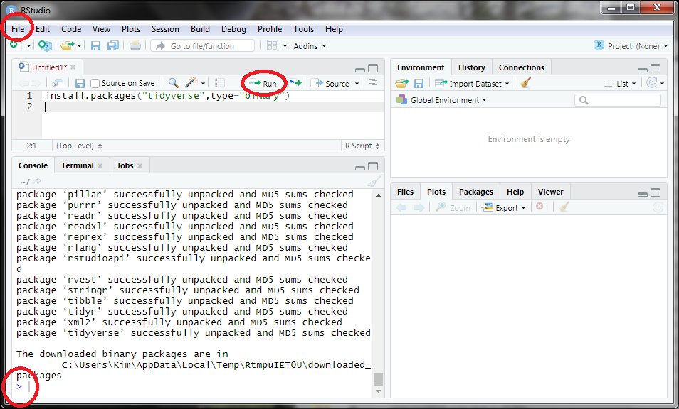
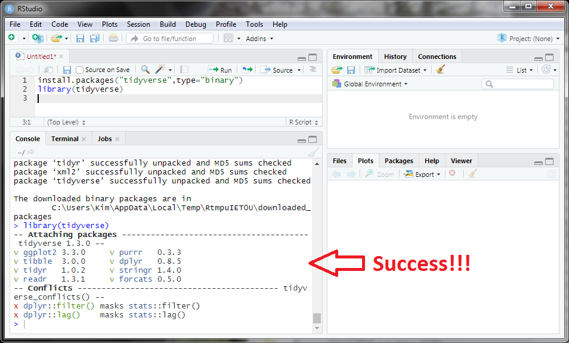

## What are R and RStudio?
Throughout this course we will use the R program to generate graphs. We will interact with R through the RStudio software. From your perspective, you will be using RStudio, but you will actually be writing code in the R language. RStudio simply helps make R a little easier to use. The following links provide very brief introductions to R and RStudio.

* [What is R?](https://www.youtube.com/watch?v=XcBLEVknqvY){:target="_blank"}
* [What's Up with R?](https://www.youtube.com/watch?v=ZwYQPtU2Pa0){:target="_blank"} [*stop at 1:51*]
* [What is RStudio (Part 1)?](https://www.youtube.com/watch?v=riONFzJdXcs){:target="_blank"} [*stop at 2:27*]
* [What is RStudio (Part 2)?](https://www.youtube.com/watch?v=riONFzJdXcs){:target="_blank"} [*only from 3:16 to 4:13*]

&nbsp;

## Installing the Software and Packages
#### R and Rstudio for Windows
To install R on a Windows machine, downloaded the installer from [this site](https://cloud.r-project.org/bin/windows/base/){:target="_blank"} by selecting the "Download R X.X.X for Windows" link at the top. Locate the installer on your computer and run it. Using all of the default choices will perform an acceptable install for this class.[^WinR]

To install RStudio on a Windows machine, download the installer from [this link](https://rstudio.com/products/rstudio/download/#download){:target="_blank"} by selecting the "DOWNLOAD RSTUDIO FOR WINDOWS" button. Locate the installer on your computer and run it. Using all of the default choices will perform an acceptable install for this class.[^WinRStudio]


#### R and Rstudio for MacOS
To install R on a Mac, downloaded the installer from [this site](https://cloud.r-project.org/bin/macosx/){:target="_blank"} by selecting one of the "R-X.X.X.pkg" links appropriate for your operating system under the "Latest Release" section. Locate the ".pkg" file on your computer and install it per usual. Using all of the default choices will perform an acceptable install for this class.[^MacR]

To install RStudio on aMac, download the installer from [this link](https://rstudio.com/products/rstudio/download/#download){:target="_blank"} by selecting the "DOWNLOAD RSTUDIO FOR MACOS" button (you can also select the MacOS option under the "All Installers" section). Locate the ".dmg" file on your computer and install it per usual. Using all of the default choices will perform an acceptable install for this class.[^MacRStudio]

#### Tidyverse
Extra functionality can be added to R with packages. The "tidyverse" package is the main package that we will use in this class. You can install the tidyverse package on your computer by opening RStudio (not R but RStudio) and selecting the *File* menu, *New File* submenu, and *R Script* subsubmenu, which will open a new pane in the upper-left corner of RStudio. In that new pane type the code below exactly as it appears here.

```
install.packages("tidyverse",type="binary")
```

Then with your cursor on the line that you just type press the "Run" button towards the right side of the top of the pane you just typed in (see below). RStudio should then do a "bunch of stuff"[^InstallingNote] and you will seen a window flashing by. After several minutes, the lower-left pane (the "console") should have a ">" symbol on the last line (see below).



At this point the installation is complete if no errors occurred along the way. You can check for success by typing the code below exactly as it appears here.

```
library(tidyverse)
```




[^WinR]: More detailed instructions [are here](http://derekogle.com/IFAR/supplements/installations/InstallRWin.html){:target="_blank"}, but note that the current version is either 3.6.3 or 4.0.0.

[^WinRStudio]: More detailed instructions [are here](http://derekogle.com/IFAR/supplements/installations/InstallRStudioWin.html){:target="_blank"}, but note that the current version is at least 1.2.5042.

[^MacR]: More detailed instructions [are here](http://derekogle.com/IFAR/supplements/installations/InstallRMac.html){:target="_blank"}, but note that the current version is either 3.6.3 or 4.0.0.

[^MacRStudio]: More detailed instructions [are here](http://derekogle.com/IFAR/supplements/installations/InstallRStudioMac.html){:target="_blank"}, but note that the current version is at least 1.2.5042.