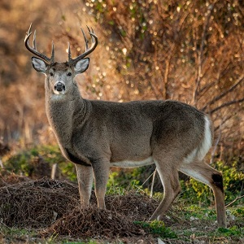

```{r echo=FALSE, eval=FALSE}
# Renders an appropriate HTML file for the webpage (CTRL-S and CTRL-ALT-C)
source(file.path(here::here(),"rhelpers/rhelpers.R"))
fnm <- "CE_DeerHarvest"
dnm <- "modules/Smoothers"
modHTML(file.path(here::here(),dnm,fnm))
FSA::purl2(file.path(here::here(),dnm,paste0(fnm,".Rmd")),
           moreItems=c("source","setwd","fnm","dnm","opts_chunk","CTRL-S"))
```
```{r echo=FALSE, results='hide', message=FALSE, warning=FALSE}
knitr::opts_chunk$set(echo=FALSE, fig.width=5, fig.height=5,out.width="60%",message=FALSE)
library(tidyverse)
```

----

## Background

This exercise uses the same harvest data for Whitetail Deer (*Odocoileus virginianus*) populations in Douglas, Bayfield, Ashland, and Iron Counties, the northern-most tier of couties in Wisconsin, from 2010-2019 used [in this exercise](../Means/CE_DeerHarvest.html). Load the data and create the same color palette used there.

```{r data-prep, echo=FALSE, results="hide"}
#!# Set to your own working directory and have just your filename below.
dh <- read.csv("https://raw.githubusercontent.com/droglenc/NCData/master/DeerHarvest.csv")
str(dh)
clrs <- c("Ashland"="#000000","Bayfield"="#E69F00","Douglas"="#56B4E9","Iron"="#009E73")
```

&nbsp;

## Bow vs Gun Harvest 1
Construct `ggplot2` code to match the graph below (as closely as you can).

```{r GunBow_1}
 bgHarv1 <- ggplot(data=dh,mapping=aes(x=Gun.Antlerless,y=Bow.Antlerless)) +
  geom_smooth(method="lm",color="blue",fill="blue",alpha=0.15) +
  geom_point(pch=21,color="black",fill="gray70",size=2.5) +
  scale_x_continuous(name="Harvest of Antlerless Deer by Gun",
                     expand=expansion(mult=0.02)) +
  scale_y_continuous(name="Harvest of Antlerless Deer by Bow",
                     expand=expansion(mult=0.01)) +
  theme_bw() +
  theme(panel.grid=element_blank())
bgHarv1
```

&nbsp;


## Bow vs Gun Harvest 2
Construct `ggplot2` code to match the graph below (as closely as you can).

```{r GunBow_2}
 bgHarv2 <- ggplot(data=dh,mapping=aes(x=Gun.Antlerless,y=Bow.Antlerless)) +
  geom_smooth(method="lm",color="blue",fill="blue",alpha=0.15) +
  geom_smooth(method="loess",color="red",fill="red",alpha=0.15) +
  geom_point(pch=21,color="black",fill="gray70",size=2.5) +
  scale_x_continuous(name="Harvest of Antlerless Deer by Gun",
                     expand=expansion(mult=0.02)) +
  scale_y_continuous(name="Harvest of Antlerless Deer by Bow",
                     expand=expansion(mult=0.01)) +
  theme_bw() +
  theme(panel.grid=element_blank())
bgHarv2
```

A regression model is much simpler to interpret than a LOESS model. Does it seem "worth it" to use the LOESS model to describe the relationship between antlerless deer harvested by bow and gun? Explain!

&nbsp;

## Bow vs Gun Harvest by County 1
Construct `ggplot2` code to match the graph below (as closely as you can).

```{r GunBow_3, fig.width=6.5, out.width="75%"}
 bgHarv3 <- ggplot(data=dh,mapping=aes(x=Gun.Antlerless,y=Bow.Antlerless,
                                       color=County,fill=County)) +
  geom_smooth(method="lm",alpha=0.15,se=FALSE) +
  geom_point(pch=21,size=2.5,alpha=0.5) +
  scale_x_continuous(name="Harvest of Antlerless Deer by Gun",
                     expand=expansion(mult=0.02)) +
  scale_y_continuous(name="Harvest of Antlerless Deer by Bow",
                     expand=expansion(mult=0.01)) +
  scale_color_manual(values=clrs) +
  scale_fill_manual(values=clrs) +
  theme_bw() +
  theme(panel.grid=element_blank())
bgHarv3
```

Does it "feel" like the relationship (i.e., the slope) between antlerless deer harvested by bow and gun differs among the counties? Explain!

&nbsp;

## Total Annual Harvest by Year and County
Construct `ggplot2` code to match the graph below (as closely as you can).

```{r Harvest_1, fig.width=6.5, out.width="75%"}
harv1 <- ggplot(data=dh,mapping=aes(x=Year,y=Ttl.All,color=County)) +
  geom_smooth(method="loess",size=1,se=FALSE) +
  geom_point(size=2.5) +
  scale_x_continuous(name="Year",breaks=seq(2010,2018,2)) +
  scale_y_continuous(name="Total Annual Deer Harvest",
                     expand=expansion(mult=c(0,0.05)),
                     limits=c(0,8000)) +
  scale_fill_manual(values=clrs) +
  scale_color_manual(values=clrs) +
  theme_bw()
harv1
```

Make two observations from this graph.
