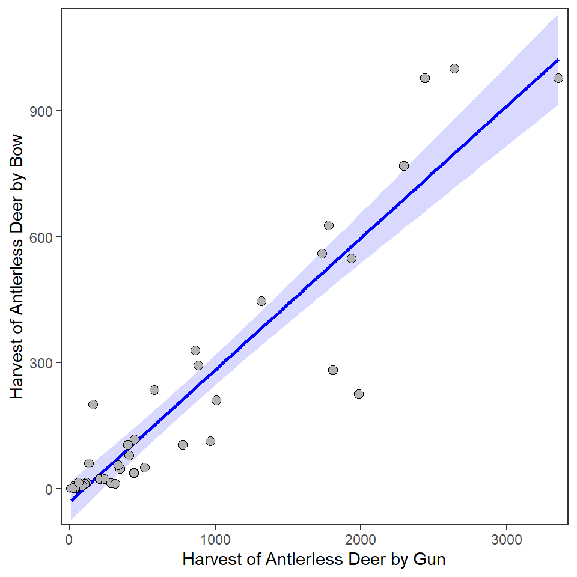
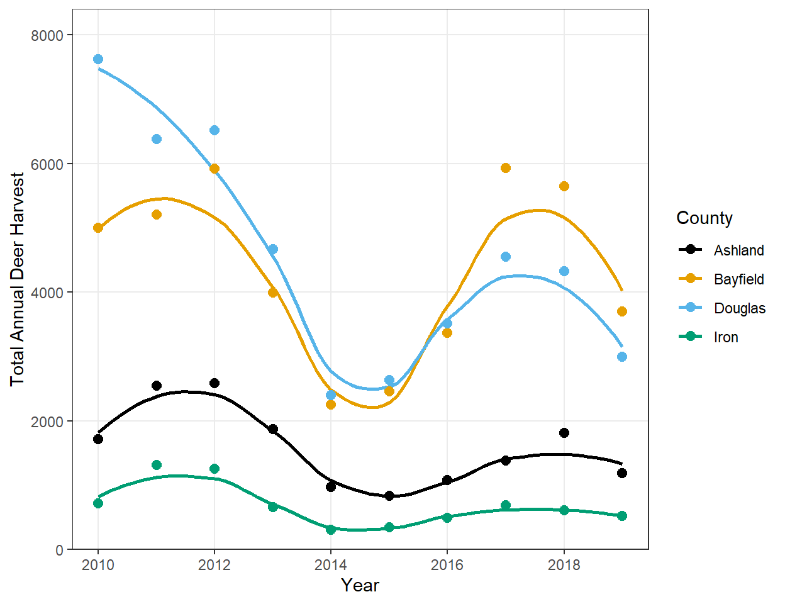

----

## Background

This exercise uses the same harvest data for Whitetail Deer (*Odocoileus virginianus*) populations in Douglas, Bayfield, Ashland, and Iron Counties, the northern-most tier of couties in Wisconsin, from 2010-2019 used [in this exercise](../Means/CE_DeerHarvest.html). Load the data and create the same color palette used there.


&nbsp;

## Bow vs Gun Harvest 1
Construct `ggplot2` code to match the graph below (as closely as you can).


```
## `geom_smooth()` using formula 'y ~ x'
```



&nbsp;


## Bow vs Gun Harvest 2
Construct `ggplot2` code to match the graph below (as closely as you can).


```
## `geom_smooth()` using formula 'y ~ x'
## `geom_smooth()` using formula 'y ~ x'
```


A regression model is much simpler to interpret than a LOESS model. Does it seem "worth it" to use the LOESS model to describe the relationship between antlerless deer harvested by bow and gun? Explain!

&nbsp;

## Bow vs Gun Harvest by County 1
Construct `ggplot2` code to match the graph below (as closely as you can).


```
## `geom_smooth()` using formula 'y ~ x'
```


Does it "feel" like the relationship (i.e., the slope) between antlerless deer harvested by bow and gun differs among the counties? Explain!

&nbsp;

## Total Annual Harvest by Year and County
Construct `ggplot2` code to match the graph below (as closely as you can).


```
## `geom_smooth()` using formula 'y ~ x'
```



Make two observations from this graph.
