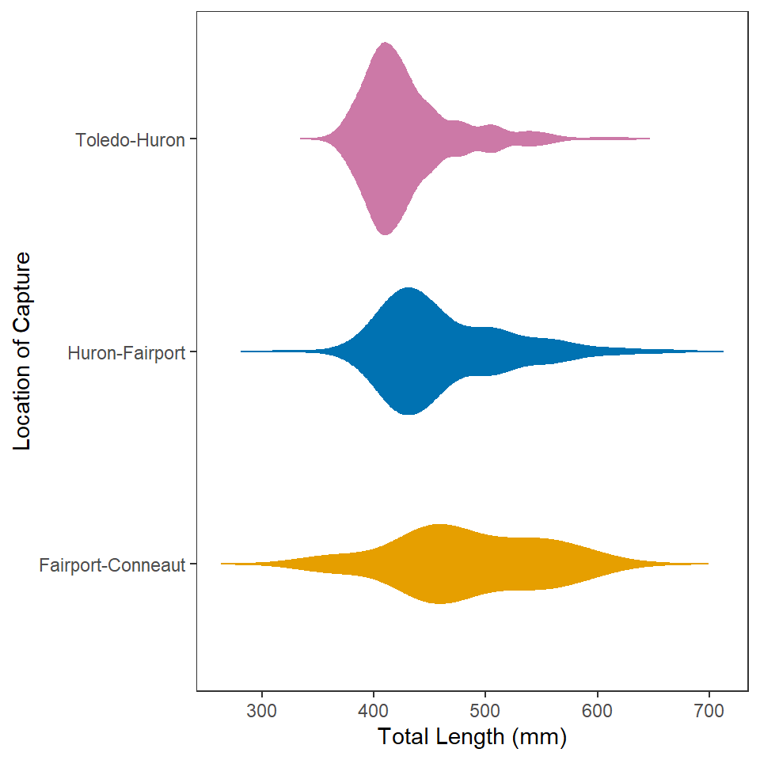

----

## Background

This is the same data set [introduced here](../Intro2/CE_Walleye.html) (which included code for accessing the data). If you did those exercises, then you can use the same data and package (e.g., `tidyverse`) loading portion of your script. If you did not do those exercises then please see that page for the instructions on loading the data.

&nbsp;

## Total Length 1
Construct `ggplot2` code to match the graph below (as closely as you can).

"Play with" `binwidth=` in `geom_histogram()` to feel how this changes the plot. What value do you prefer?

&nbsp;

## Total Length 2
Construct `ggplot2` code to match the graph below (as closely as you can). [*HINT: Copy your code from above and then modify.*]

"Play with" `adjust=` in `geom_density()` to feel how this changes the plot. What value do you prefer?

&nbsp;

## Total Length 3
Construct `ggplot2` code to match the graph below (as closely as you can ... *you don't have to match my colors, but do use other than the default colors*).

&nbsp;

## Total Length 4
Construct `ggplot2` code to match the graph below (as closely as you can).

&nbsp;

## Total Length 5
Construct `ggplot2` code to match the graph below (as closely as you can). [*HINT: Copy your code from above and then modify.*]

&nbsp;

## Total Length 6
Construct `ggplot2` code to match the graph below (as closely as you can ... *you don't have to match my colors, but do use other than the default colors*). [*HINT: Copy your code from above and then modify.*]

&nbsp;

## Total Length 7
Construct `ggplot2` code to match the graph below (as closely as you can). [*HINT: Copy your code from above and then modify.*]

This plot can also[^coord_flip] be produced from your "Walleye Total Length 6" plot with the addition of one more line of code. Perform an internet search to see if you can find this method for flipping the coordinates.

&nbsp;

## BONUS - Total Length 8
Construct `ggplot2` code to match the graph below (as closely as you can). *Hints: (1) This plot has been "faceted", which may help your Google search, (2) this can be created from your "Total Length 1" plot with one extra function of code (assuming you saved that plot into an object), and (3) change to `fig.height=8` in the code chunk header for this plot.*

