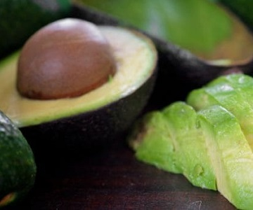

```{r echo=FALSE, eval=FALSE}
# Renders an appropriate HTML file for the webpage (CTRL-S and CTRL-ALT-C)
source(file.path(here::here(),"rhelpers/rhelpers.R"))
fnm <- "Demo_Avocados"
dnm <- "modules/Univariate_Density"
modHTML(file.path(here::here(),dnm,fnm))
```
```{r echo=FALSE}
knitr::opts_chunk$set(echo=FALSE, fig.width=5, fig.height=5)
```

----

## Background

Kaggle has a database of the price and sales of avocados from many areas around the United States from 2015-2018. The [data is here](https://raw.githubusercontent.com/droglenc/NCData/master/Avocados.csv) (with [metadata under "columns" at this site](https://www.kaggle.com/neuromusic/avocado-prices)).[^getdata] Make sure to load `tidyverse`.

```{r echo=TRUE, results='hide', message=FALSE, warning=FALSE}
library(tidyverse)
```

Their data are loaded below[^loaddata] and, for this exercise, reduced to only results for the "GreatLakes" region (i.e., `filter()`), and `type` and `year` are converted to groupings (i.e., `factor()` within `mutate()`).[^copycode]

```{r echo=TRUE, results='hide'}
#!# Set to your own working directory and have just your filename below.
avoc <- read.csv("https://raw.githubusercontent.com/droglenc/NCData/master/Avocados.csv",
                stringsAsFactors=FALSE,quote="") %>%
  filter(region=="GreatLakes") %>%
  mutate(type=factor(type),
         year=factor(year))
str(avoc)
```

&nbsp;

## Example 1
Construct `ggplot2` code to match the graph below (as closely as you can).

```{r avoc1}
avoc1 <- ggplot(data=avoc,mapping=aes(x=AveragePrice)) +
  geom_histogram(col="black",fill="beige",binwidth=0.1,boundary=0,closed="left") +
  scale_x_continuous(name="Average Price of An Avocado ($)",
                     breaks=seq(0.5,2,0.25),limits=c(0.5,2),
                     expand=expansion(mult=c(0.02,0.02))) +
  scale_y_continuous(name="Frequency of Reports",
                     expand=expansion(mult=c(0,0.05))) +
  theme_bw()
avoc1
```

&nbsp;

## Example 2
Construct `ggplot2` code to match the graph below (as closely as you can).

```{r avoc2, warning=FALSE}
avoc2 <- ggplot(data=avoc,mapping=aes(x=year,y=AveragePrice,fill=year)) +
  geom_violin(col="black",trim=FALSE) +
  scale_y_continuous(name="Average Price of An Avocado ($)",
                     breaks=seq(0.5,2,0.25),limits=c(0.5,2)) +
  scale_x_discrete(name="Year of Reports") +
  scale_fill_manual(values=c("#999999","#E69F00","#009E73","#CC79A7")) +
  theme_bw() +
  theme(legend.position="none")
avoc2
```

### Footnote
[^getdata]: This CSV file is freely available from Kaggle at [this page](). However, you must sign-in to download the data file. I did this and made it available from my website at the link above.

[^loaddata]: These data were read directly from the webpage. However, the data can be downloaded to your computer and loaded from there into R, which would be similar to how you would load your own data into R. How to load a CSV file into RStudio is [described in this video](https://vimeo.com/144035138), for which the password is "NCStats" (without the quotes).

[^copycode]: These code can be copied as is, but make sure to set your working directory with `setwd()` and to put just the filename inside `read.csv()`.
