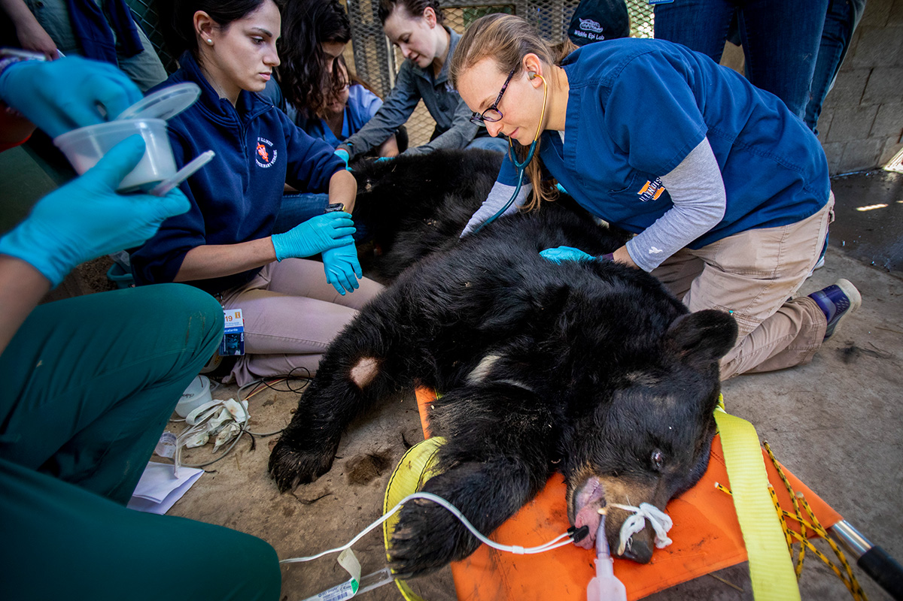

```{r purler, eval=FALSE, echo=FALSE}
## Use Knit button to make actual slides.
## Makes (Ctrl-S & Ctrl-Alt-C) a script ... will need to edit.
fnm <- "Lecture_BlackBears"
FSA::purl2(file.path(here::here(),"modules/Univariate_Density",paste0(fnm,".Rmd")),
           moreItems=c("source","setwd","fnm","opts_chunk","flipbookr",
                       "include_graphics","options","splitPerc","leftAssign"))
```

```{r setup, include = FALSE}
knitr::opts_chunk$set(fig.width=5.4,fig.height=4,out.width="100%",fig.retina=3,message=FALSE,warning=FALSE,comment="",cache=FALSE)
library(flipbookr)
library(tidyverse)
library(patchwork)
options(width=120,show.signif.stars=FALSE)
splitPerc <- 50
leftAssign <- TRUE
```

# Background

- Morphological measurements of Florida Black Bear (*Ursus americanus floridanus*).
  - Published in [Bartareau, T.M. 2017. Estimating the live body weight of American Black Bears in Florida. Journal of Fish and Wildlife Management 8:234-239](https://www.fwspubs.org/doi/10.3996/012016-JFWM-003).
  - Data provided as a supplement.

.center[
```{r, echo=FALSE, out.width="500px"}

```
<font size="1">Credit: <a href="https://news.illinois.edu/view/6367/803074">University of Illinois</a></font>
]

---

# Background

- Downloaded 'fwma-08-01-02_table s1.xls' Excel file from [Journal of Fish and Wildlife Management](https://www.fwspubs.org/doi/10.3996/012016-JFWM-003).

--
- Data in sheet 1 of Excel data file loaded into `flbb` data.frame.
  - Renamed some variables to remove spaces and capitalization.
  - Changed sex labels and made `sex` a factor variable.

```{r load1}
flbb <- readxl::read_excel("fwma-08-01-02_table s1.xls") %>%
  rename(sex=SEX,age=`AGE (yr)`,length=`BODY LENGTH (cm)`,
         weight=`BODY WEIGHT (kg)`,chest=`CHEST GIRTH (cm)`) %>%
  mutate(sex=plyr::mapvalues(sex,from=c("FEMALE","MALE"),to=c("Female","Male")),
         sex=factor(sex))
```

---

# Background

```{r}
head(flbb)
```

- Variables are:
  - **DATE**: Date of capture (*won't be used here*).
  - **sex**: Sex of bear (`Female` or `Male`).
  - **age**: Estimated age of the bear (years).
  - **weight**: Body weight of the bear (kg).
  - **chest**: Chest girth of the bear (cm).
  - **length**: Body length of the bear (cm).

--
- Our focus here will be on `weight` and `sex`.

---

# Histogram

.pull-left[
- Displays the frequency of observations in "bins" of the quantitative *X* variable.
  - i.e., the distribution of *X*.
]

.pull-right[
```{r hist_demo, echo=FALSE}
h <- ggplot(data=flbb, mapping=aes(x=weight)) +
  geom_histogram(binwidth=10,boundary=0,closed="left",
                 color="gray30",fill="gray70") +
  scale_x_continuous(name="Weight (kg)",breaks=seq(0,250,25),
                     expand=expansion(mult=c(0,0))) +
  scale_y_continuous(name="Frequency of Bears",
                     expand=expansion(mult=c(0,0.05))) +
  theme_bw() +
  theme(panel.grid.major.x=element_blank(),
        panel.grid.minor.x=element_blank())
h
```
]

---

# Histogram

.pull-left[
- Constructed with `geom_histogram()`.
  - `bins=`: Number of bins to use.
  - `binwidth=`: Width of the bins.
  - `boundary=`: Sets left-most boundary of first bin.
  - `center=`: Sets center of first bin.
  - `closed=`: Sets if bins are closed on `"right"` (*default*) or `"left"`.
]

.pull-right[
```{r echo=FALSE}
<<hist_demo>>
```
]

---

class: inverse, center, middle

# A Mostly Default Histogram

---

```{r hist1, include=FALSE}
p <- ggplot(data=flbb, mapping=aes(x=weight)) +
  geom_histogram() +
  scale_y_continuous(name="Frequency of Bears") +
  scale_x_continuous(name="Weight (kg)",
                     breaks=seq(0,250,25)) +
  theme_bw()
```

`r chunk_reveal("hist1",break_type="auto",left_assign=leftAssign,split=splitPerc)`

---

class: inverse, center, middle

# Histogram with Typical Modifications

---

```{r hist2, include=FALSE}
p <- ggplot(data=flbb, mapping=aes(x=weight)) +
  geom_histogram(
    color="gray30", #BREAK2
    fill="gray70", #BREAK3
    binwidth=10, #BREAK4
    boundary=0,closed="left" #BREAK5
  ) +
  scale_y_continuous(
    name="Frequency of Bears",
    expand=expansion(mult=c(0,0.05)) #BREAK6
  ) +
  scale_x_continuous(
    name="Weight (kg)",breaks=seq(0,250,25),
    expand=expansion(mult=c(0,0)) #BREAK7
  ) +
  theme_bw()
```

`r chunk_reveal("hist2",break_type="non_seq",left_assign=leftAssign,split=splitPerc)`

---

class: inverse, center, middle

# Histogram with Typical Modifications

### Finish by Removing Vertical Grids

---
```{r hist3, include=FALSE}
p <- ggplot(data=flbb, mapping=aes(x=weight)) +
  geom_histogram(color="gray30",fill="gray70",
                 binwidth=10,boundary=0,closed="left") +
  scale_y_continuous(name="Frequency of Bears",
                     expand=expansion(mult=c(0,0.05))) +
  scale_x_continuous(name="Weight (kg)",breaks=seq(0,250,25),
                     expand=expansion(mult=c(0,0))) +
  theme_bw() + #BREAK
  theme(panel.grid.major.x=element_blank(),
        panel.grid.minor.x=element_blank())  
```

`r chunk_reveal("hist3",break_type="user",left_assign=leftAssign,split=splitPerc)`

---

class: inverse, center, middle

# Stacked Histogram (Split by Groups)

---

```{r histsplit1, include=FALSE}
p <- ggplot(data=flbb,mapping=aes(
              x=weight,
              color=sex, #BREAK2
              fill=sex #BREAK3
            )) +
  geom_histogram(binwidth=10,boundary=0,closed="left",
                 alpha=0.25 #BREAK4
  ) +
  scale_y_continuous(name="Frequency of Bears",
                     expand=expansion(mult=c(0,0.05))) +
  scale_x_continuous(name="Weight (kg)",breaks=seq(0,250,25),
                     expand=expansion(mult=c(0,0))) +
  theme_bw() +
  theme(panel.grid.major.x=element_blank(),
        panel.grid.minor.x=element_blank())
```

`r chunk_reveal("histsplit1",break_type="non_seq",left_assign=leftAssign,split=splitPerc)`

---

class: inverse, center, middle

# Stacked Histogram (Split by Groups)

### Modify the Default Colors

---

```{r histsplit2, include=FALSE}
p <- ggplot(data=flbb,
            mapping=aes(x=weight,color=sex,fill=sex)) +
  geom_histogram(binwidth=10,boundary=0,closed="left",
                 alpha=0.25) +
  scale_y_continuous(name="Frequency of Bears",
                     expand=expansion(mult=c(0,0.05))) +
  scale_x_continuous(name="Weight (kg)",breaks=seq(0,250,25),
                     expand=expansion(mult=c(0,0))) +
  theme_bw() +
  theme(panel.grid.major.x=element_blank(),
        panel.grid.minor.x=element_blank()) + #BREAK
  scale_color_manual(values=c("red3","blue3")) + #BREAK
  scale_fill_manual(values=c("red3","blue3"))
```
```{r include=FALSE}
h2 <- p # for boxplots later
```

`r chunk_reveal("histsplit2",break_type="user",left_assign=leftAssign,split=splitPerc)`

---

class: inverse, center, middle

# Density Plot

---

.pull-left[
# Density Plot
- Displays the density of observations of the quantitative *X* variable.
  - i.e., the relative distribution of *X*.
  - A smoothed representation of a histogram.
- Constructed with `geom_density()`.
]

.pull-right[
```{r density_demo, echo=FALSE, fig.width=5.4, fig.height=8, out.width="100%"}
d <- ggplot(data=flbb, mapping=aes(x=weight)) +
  geom_density(color="gray30",fill="gray30",alpha=0.25) +
  scale_x_continuous(name="Weight (kg)",
                     limits=c(0,250),breaks=seq(0,250,25),
                     expand=expansion(mult=c(0,0))) +
  scale_y_continuous(name="Relative Density of Bears",
                     expand=expansion(mult=c(0,0.05))) +
  theme_bw() +
  theme(panel.grid.major.x=element_blank(),
        panel.grid.minor.x=element_blank())
h <- h + scale_x_continuous(name="Weight (kg)",
                     limits=c(0,250),breaks=seq(0,250,25),
                     expand=expansion(mult=c(0,0)))
d / h
```
]

---

class: inverse, center, middle

# Density Plot

### With Same Modifications as Histogram

---

```{r density1, include=FALSE}
p <- ggplot(data=flbb, mapping=aes(x=weight)) +
  geom_density(
    color="gray30", #BREAK2
    fill="gray30", #BREAK3
    alpha=0.25 #BREAK4
  ) +
  scale_x_continuous(
    name="Weight (kg)",
    breaks=seq(0,250,25),expand=expansion(mult=c(0,0)),
    limits=c(0,250), #BREAK5
  ) +
  scale_y_continuous(name="Relative Density of Bears",
                     expand=expansion(mult=c(0,0.05))) +
  theme_bw() +
  theme(panel.grid.major.x=element_blank(),
        panel.grid.minor.x=element_blank())
```

`r chunk_reveal("density1",break_type="non_seq",left_assign=leftAssign,split=splitPerc)`

---

class: inverse, center, middle

# Density Plot by Groups

---

```{r densitysplit1, include=FALSE}
p <- ggplot(data=flbb, mapping=aes(
  x=weight,
  color=sex, #BREAK2
  fill=sex #BREAK3
  )) +
  geom_density(alpha=0.25) +
  scale_x_continuous(name="Weight (kg)",
                     breaks=seq(0,250,25),limits=c(0,250),
                     expand=expansion(mult=c(0,0))) +
  scale_y_continuous(name="Relative Density of Bears",
                     expand=expansion(mult=c(0,0.05))) +
  scale_color_manual(values=c("red3","blue3")) + #BREAK4
  scale_fill_manual(values=c("red3","blue3")) + #BREAK5
  theme_bw() +
  theme(panel.grid.major.x=element_blank(),
        panel.grid.minor.x=element_blank())
```

`r chunk_reveal("densitysplit1",break_type="non_seq",left_assign=leftAssign,split=splitPerc)`


---

class: inverse, center, middle

# Boxplot

---

.pull-left[
# Boxplot
- Displays summary statistics that describe the distribution of the quantitative *X* variable.
  - "Box" is from 1st quartile (Q1) to 3rd quartile (Q3).
  - Line in box is median.
  - "Whiskers" extend to min/max or last point not considered an "outlier."
  - "Outliers" are more than 1.5*IQR from Q1 or Q3.
- Usually for comparing groups.
- Constructed with `geom_boxplot()`.
]

.pull-right[
```{r boxplot_demo, echo=FALSE, fig.width=5.4, fig.height=8, out.width="100%"}
b <- ggplot(data=flbb, mapping=aes(x=weight,y=sex,color=sex,fill=sex)) +
  geom_boxplot(alpha=0.25) +
  scale_x_continuous(name="Weight (kg)",
                     limits=c(0,250),breaks=seq(0,250,25),
                     expand=expansion(mult=c(0,0))) +
  scale_color_manual(values=c("red3","blue3")) +
  scale_fill_manual(values=c("red3","blue3")) +
  theme_bw() +
  theme(panel.grid.major.x=element_blank(),
        panel.grid.minor.x=element_blank())
b / h2 & theme(legend.position="none")
```
]

---

class: inverse, center, middle

# Boxplot with Modifications

---

```{r boxplot1, include=FALSE}
p <- ggplot(data=flbb, mapping=aes(x=weight,y=sex,
                                   color=sex,fill=sex)) +
  geom_boxplot(alpha=0.25) +
  scale_x_continuous(name="Weight (kg)",
                     limits=c(0,250),breaks=seq(0,250,25),
                     expand=expansion(mult=c(0,0))) +
  scale_color_manual(values=c("red3","blue3")) +
  scale_fill_manual(values=c("red3","blue3")) +
  theme_bw() +
  theme(legend.position="none")
```

`r chunk_reveal("boxplot1",break_type="auto",left_assign=leftAssign,split=splitPerc)`

---

class: inverse, center, middle

# Boxplot in Horizontal Orientation

---

```{r boxplot2, include=FALSE}
p <- ggplot(data=flbb, mapping=aes(x=weight,y=sex)) +
  geom_boxplot(fill="gray30",alpha=0.25) +
  scale_x_continuous(name="Weight (kg)",
                     limits=c(0,250),breaks=seq(0,250,25),
                     expand=expansion(mult=c(0,0))) +
  theme_bw() +
  theme(legend.position="none") +
  coord_flip()
```

`r chunk_reveal("boxplot2",break_type="auto",left_assign=leftAssign,split=splitPerc)`


---

class: inverse, center, middle

# Violin Plot

---

.pull-left[
# Violin Plot
- Displays density of the quantitative *X* variable.
- Usually for comparing groups.
- Constructed with `geom_violin()`.
  - Very similar to use of `geom_boxplot()`.
    - Suggest using `trim=FALSE`.
]

.pull-right[
```{r violin_demo, echo=FALSE, fig.width=5.4, fig.height=8, out.width="100%"}
v <- ggplot(data=flbb, mapping=aes(x=weight,y=sex,color=sex,fill=sex)) +
  geom_violin(alpha=0.25,trim=FALSE) +
  scale_x_continuous(name="Weight (kg)",
                     limits=c(0,250),breaks=seq(0,250,25),
                     expand=expansion(mult=c(0,0))) +
  scale_color_manual(values=c("red3","blue3")) +
  scale_fill_manual(values=c("red3","blue3")) +
  theme_bw() +
  theme(panel.grid.major.x=element_blank(),
        panel.grid.minor.x=element_blank())

d2 <- ggplot(data=flbb, mapping=aes(x=weight,color=sex,fill=sex)) +
  geom_density(alpha=0.25) +
  scale_x_continuous(name="Weight (kg)",
                     breaks=seq(0,250,25),limits=c(0,250),
                     expand=expansion(mult=c(0,0))) +
  scale_y_continuous(name="Relative Density of Bears",
                     expand=expansion(mult=c(0,0.05))) +
  scale_color_manual(values=c("red3","blue3")) + #BREAK4
  scale_fill_manual(values=c("red3","blue3")) + #BREAK5
  theme_bw() +
  theme(panel.grid.major.x=element_blank(),
        panel.grid.minor.x=element_blank())

v / d2 & theme(legend.position="none")
```
]

---

class: inverse, center, middle

# Violin Plot in Horizontal Orientation

---

```{r violin2, include=FALSE}
p <- ggplot(data=flbb, mapping=aes(x=weight,y=sex)) +
  geom_violin(fill="gray30",alpha=0.25,trim=FALSE) + #BREAK
  scale_x_continuous(name="Weight (kg)",
                     limits=c(0,250),breaks=seq(0,250,25),
                     expand=expansion(mult=c(0,0))) +
  theme_bw() +
  theme(legend.position="none") + #BREAK
  coord_flip()
```

`r chunk_reveal("violin2",break_type="user",left_assign=leftAssign,split=splitPerc)`

---

class: inverse, center, middle

# Violin Plot in Horizontal Orientation

### With Individual Points

---

```{r violin3, include=FALSE}
p <- ggplot(data=flbb, mapping=aes(x=weight,y=sex)) +
  geom_violin(fill="gray30",alpha=0.25,trim=FALSE) +
  scale_x_continuous(name="Weight (kg)",
                     limits=c(0,250),breaks=seq(0,250,25),
                     expand=expansion(mult=c(0,0))) +
  theme_bw() +
  theme(legend.position="none") +
  coord_flip() + #BREAK
  geom_jitter(width=0,height=0.05)
```

`r chunk_reveal("violin3",break_type="user",left_assign=leftAssign,split=splitPerc)`

---

```{css, eval= TRUE, echo = FALSE}
.remark-code{line-height: 1.5; font-size: 60%}
.remark-slide-content {font-size: 24px;padding: 1em 4em 1em 4em}
```
