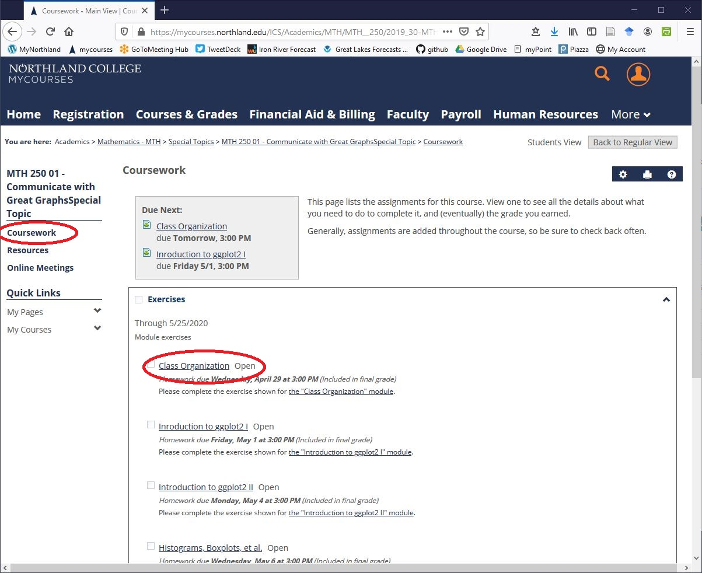
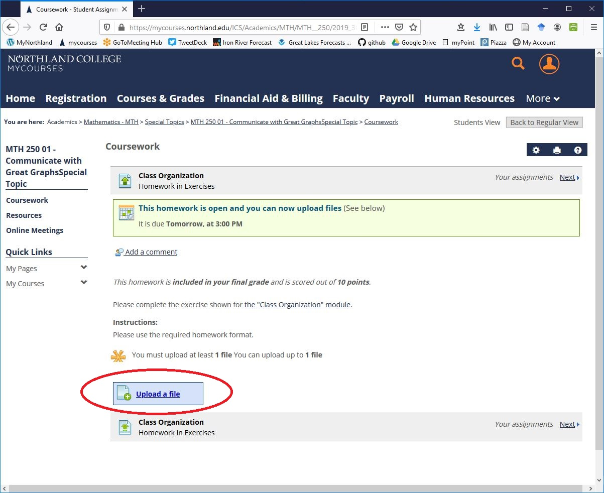
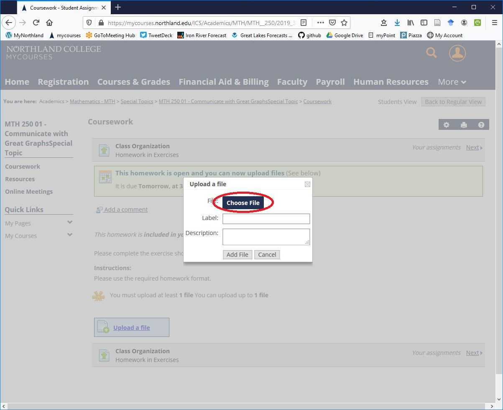
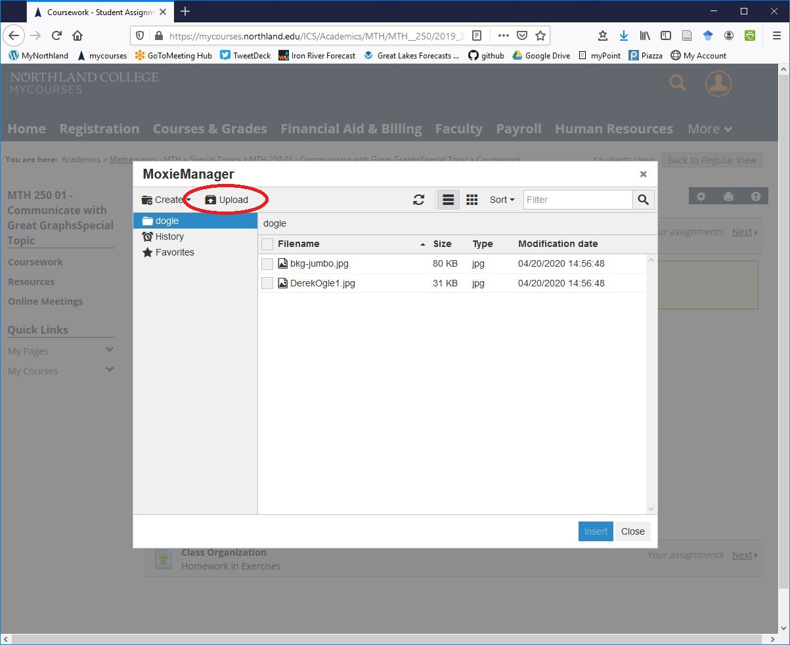
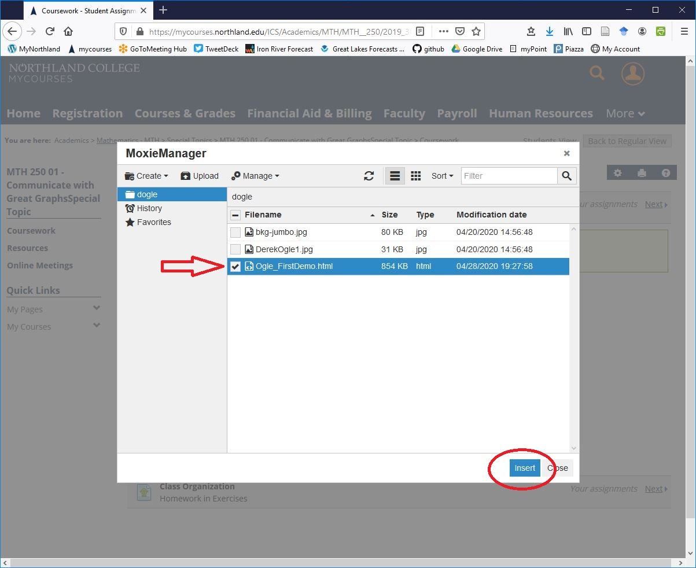
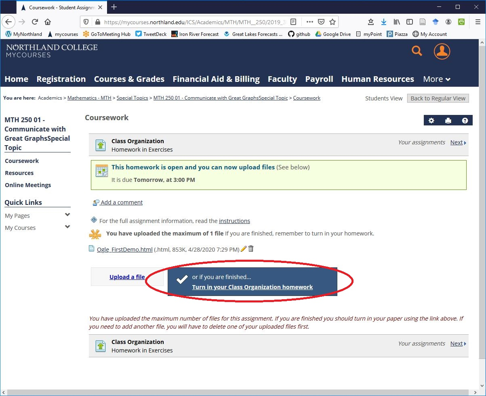
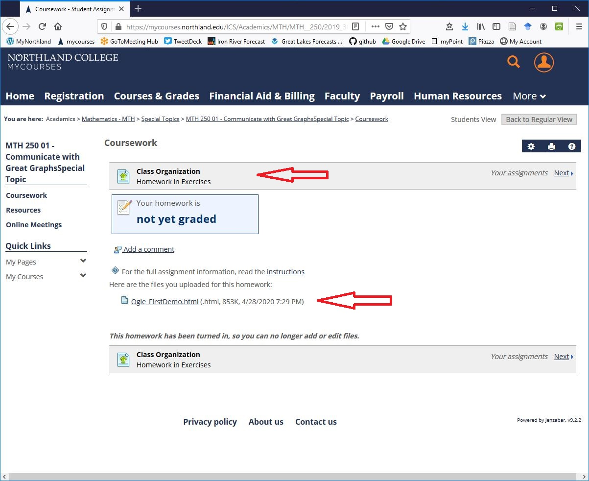

The following are directions for submitting the HTML homework items.

* Go to the [Exercises unit on the Courswork section of mycourses.northland.edu](https://mycourses.northland.edu/ICS/Academics/MTH/MTH__250/2019_30-MTH__250-01/Coursework.jnz){:target="_blank"}.
* Select the "Coursework" item in the right-side menu. The select the module for which you wish to submit a completed homework (the "Class Organization" item in the example below).

* Select the "Upload a file" button.

* Select the "Choose File" button.

* Select the "Upload" button. Browse to where your completed homework file is located on your computer.

* Make sure the correct file is selected and then press the "Insert" button.

* Select the "Add File" button.

* Select the "Turn in your ... homework" button.

* You should see a screen that resembles that below, which shows the file(s) that you have uploaded.

