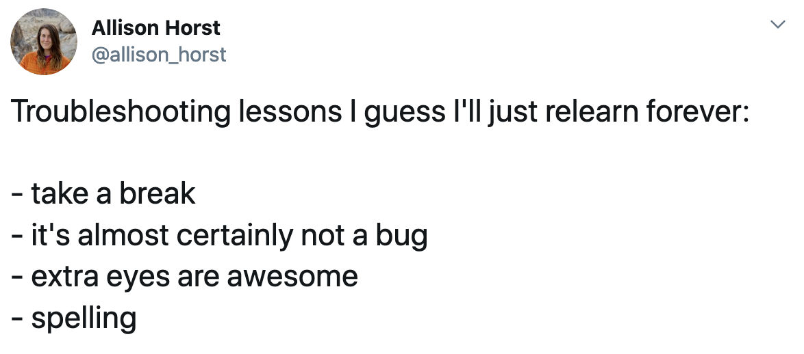

<h1>Communicating Ideas with Great Graphics in R</h1>

<figure>
  
  <figcaption>From <a href="https://medium.com/the-coffeelicious/who-needs-computers-to-visualize-data-cartoon-d2c5a78d735f" target="_blank">The Coffeelicious</a></figcaption>
</figure>

----

## Syllabus Contents

* [Catalog Description](#catalog-description) and [Learning Outcomes](#learning-outcomes)
* [Delivery](#delivery)
* [Assistance](#assistance) -- [Instructor](#instructor--derek-ogle), [Accommodations](#accommodations), and [Academic Alerts](#academic-alerts)
* [Grading](#grading) -- [Homework](#homework), [Final Project](#final-project)
* [Expectations](#expectations) -- [Ownership of Learning](#ownership-of-learning), [Work Outside of Class](#work-outside-of-class), [Classroom Conduct and Academic Integrity](#classroom-conduct-and-academic-integrity)

----

## Catalog Description

Student will use the “grammar of graphics” to create elegant and engaging graphs for communicating ideas to scientific and lay audiences. Foundational principles of the grammar of graphics will be emphasized so that students can make any graph they can imagine. Class examples will be drawn from a variety of fields including the environmental, natural resources, and social sciences; business; and sports. Prerequisite is [MTH107]() or instructor's consent after demonstrating a simple familiarity with the R software (instructor can provide preparatory resources).

## Learning Outcomes

In this course, you will have the opportunity to:

1. Describe the foundational principles of the "grammar of graphics";
1. Use the grammar of graphics to construct traditional graphs such as histograms, barplots, scatterplots, line plots, and time series plots;
1. Use "aesthetics", "scales", "annotations", and "facets" to modify traditional graphs to display multiple levels of information;
1. Explain how colors and typography affect the audience's appreciation of graphs;
1. Construct composites of multiple graphs to illustrate a complete narrative with data;
1. Become proficient with using the ggplot2 package in the R environment to construct elegant and informative graphs;
1. Explain the importance of "tidy data" with respect to the "grammar of graphics"; and
1. Use some R functions to create "tidy data" from "untidy data."

While this course does not fulfill any requirements in the [General Education Program](https://my.northland.edu/faculty/fac-academic-programs/) it does support the "[c]ommunicate mathematical information ... visually ..." outcome.

----

## Delivery

This course will be delivered in a synchronous "on-line" format throught the "online meeting app" on [mycourses.northland.edu](https://mycourses.northland.edu/ICS/Academics/MTH/MTH__250/2019_30-MTH__250-01/Online_Meetings.jnz) from 4-6pm on Monday, Wednesday, and Friday of May term. **You should make every effort to attend these online sessions as this will be the best opportunity to ask questions and get help from me and others in the class.**

I do understand during this "period of disruption" that you may miss an occasional class period. A video will be made of each synchronous meeting and will be available to view asychronously (i.e., at other times). Also see the [Assistance](#assistance) section next for other ways to receive help with course material.

----

## Assistance

This class will have lots of coding in R. Learning R can be difficult at first — it’s like learning a new language, just like Spanish, French, or Chinese.[^encouragement] Hadley Wickham, chief data scientist at RStudio and author of ggplot2, said this:

> It’s easy when you start out programming to get really frustrated and think, “Oh it’s me, I’m really stupid,” or, “I’m not made out to program.” But, that is absolutely not the case. Everyone gets frustrated. I still get frustrated occasionally when writing R code. It’s just a natural part of programming. So, it happens to everyone and gets less and less over time. Don’t blame yourself. Just take a break, do something fun, and then come back and try again later.

This cartoon illustrates what Hadley explains and how you will likely feel at some point this term.

<figure>
  
  <figcaption>From <a href="https://github.com/allisonhorst/stats-illustrations" target="_blank">Allison Horst</a>.</figcaption>
</figure>

If you find yourself in this situation follow the advice of Hadley above and Allison below.

In terms of "extra eyes" ... ask a classmate a question, ask classmates or me a question on the [Piazza forum](https://mycourses.northland.edu/ICS/piazza.com/northland/spring2020/mth250/home), or [e-mail me directly](mailto:dogle@northland.edu). I will monitor Piazza and my e-mail regularly and will respond with assistance as quickly as I can. I am here to help you and I **want** to help you learn the concepts and skills of this class.

I *promise* you that you can succeed in this class, but you will need to ask a question at some point. Please don't hesitate to reach out for help.

&nbsp;

### Accommodations
I want to create an inclusive and accessible learning environment for those of you that have a condition (e.g., attention, learning, vision, hearing, mental, physical, or other health-related concern) that may require special accommodations. *If you have already established accommodations* with the Office of Accessibility Resources (OAR), please communicate your approved accommodations to me as soon as possible so that we can discuss your needs in this course. If you have a condition that requires accommodations but *you have not yet established services* through OAR, then you should contact Jennifer Newago as soon as possible (Ponzio 230, x1387, or <a href="mailto:accomodations@northland.edu">accomodations@northland.edu</a>). It is the policy and practice of Northland College to create inclusive and accessible learning environments consistent with federal and state law. <a href="https://my.northland.edu/life/be-healthy/accommodations/">More information is available here.</a>

### Academic Alerts

As you adjust to college, you may benefit from working with a professional on your organization, motivation, and stress level. If I observe you struggling with the course early in the term then I may file an "Academic Alert" about you. If this happens, you will receive an e-mail from me that explains steps you can take to improve your performance in the course. Our Academic Success Coordinator, Gina Kirsten, will receive the alert and will likely also reach out to you to set up a time to further discuss ways to improve in the course. **Academic Alerts are not punitive**, they are simply an attempt to help you get back on track in this course as soon as possible.

----

## Grading

An overall grade will be computed from your performance on daily exercises (75%) and a final project (25%), which are both described below.

### Exercises
Most course modules will have exercises that will be due by 3pm on the day of the *next* class period after the exercises are completed. For examle, if we complete a module in Monday's class period then the exercises for that module will be due on Wednesday (two days later) by 3pm. All exercises should be formatted as I described on the first day of class and handed in to me by uploading your MSWord document to XXX.

Each exercise set is worth 10 points and will be graded with a two-part rubric. The first part of the rubric is based on your *completion* of the exercise.

  <table class="table table-bordered">
  <thead>
    <tr class="info"><th>5 points</th><th>5-1 points</th><th>0 points</th></tr>
  </thead>
  <tbody>
    <tr><td>All parts of the exercise were completed in full and followed the required homework format.</td><td>Some parts of the exercise were either not attempted or were incomplete. The required format was followed.</td><td>Very little of the exercise was completed or the required format was not followed.</td></tr>
  </tbody>
  </table>

The second part of the rubric is based on your correctness in performing the work.

  <table class="table table-bordered">
  <thead>
    <tr class="info"><th>5 points</th><th>5-1 points</th><th>0 points</th></tr>
  </thead>
  <tbody>
    <tr><td>All or nearly all parts of the exercise were correct.</td><td>Various amounts of the exercise were done correctly.</td><td>Very little of the exercise was done correctly.</td></tr>
  </tbody>
  </table>

**Exercises handed in late may still receive "completeness" points but may not receive any "correctness" points.**

### Final Project

XXX

#### Note About Incomplete Grades
An incomplete grade will be given ONLY in extreme circumstances that are beyond your control, such as a major illness, and will ONLY be given if you have successfully completed the entire course except for the final exam. This is in accordance with [Northland College policy](https://my.northland.edu/student-policies/academic-policies/#grades){:target="_blank"} (scroll down to "Incomplete Grades").

----

## Classroom Conduct and Academic Integrity

XXX

Finally, note that the [College's Academic Integrity Statement & Policy](https://my.northland.edu/student-policies/academic-policies/#academic-integrity){:target="_blank"} will be followed in this course. Please make sure that you are familiar with its content.

----

### Footnotes

[^help]: Quotes from [BurnishedChaos.com](https://burnishedchaos.com/quotes-about-asking-for-help/){:target="_blank"}.

[^email]: While I am pretty open-minded and not much of a stickler when it comes to e-mail etiquette, some professors are. And it is always better to send an appropriate rather than an inappropriate e-mail. [Here](https://www.scribendi.com/advice/how_to_email_a_professor.en.html) and [here](https://www.insidehighered.com/views/2015/04/16/advice-students-so-they-dont-sound-silly-emails-essay) are some good suggestions for e-mailing professors.

[^1]: I believe the research (e.g., [here](http://www.medicaldaily.com/why-using-pen-and-paper-not-laptops-boosts-memory-writing-notes-helps-recall-concepts-ability-268770){:target="_blank"}, [here](http://www.pbs.org/wgbh/nova/next/body/taking-notes-by-hand-could-improve-memory-wt/){:target="_blank"}, and [here](http://www.lifehack.org/articles/featured/writing-and-remembering-why-we-remember-what-we-write.html){:target="_blank"}) that suggests that you are more likely to remember concepts if you hand-write those concepts down, rather than copy-and-pasting or typing the text.

[^2]: General advice for how much time should be spent outside of class for each hour inside of class can be found, among many, [here](https://www.collegeparentcentral.com/2010/02/is-your-college-student-investing-enough-time-studying/){:target="_blank"}, [here](http://classroom.synonym.com/ratio-studying-class-time-college-1075.html){:target="_blank"}, [here](https://www.usu.edu/asc/studysmart/pdf/estimating_study_hours.pdf){:target="_blank"}, and [here](http://collegelife.about.com/od/academiclife/f/How-Much-Time-Should-I-Spend-Studying-In-College.htm){:target="_blank"}.

[^DistractionAids]: Also see the following resources for other apps that may help you eliminate distractions from your devices ... [here](https://georgehalachev.com/2019/01/15/7-apps-that-will-help-you-beat-procrastination/){:target="_blank"}, [here](https://www.careercontessa.com/advice/best-apps-chronic-procrastinator/){:target="_blank"}, [here](https://highschoolhints.com/6-apps-that-will-stop-your-procrastinating/){:target="_blank"}, or [here](https://remotebliss.com/procrastination-apps/){:target="_blank"}.

[^encouragement]: This is largely from [Dr. Ted Laderas](https://ready4r.netlify.com/syllabus/).