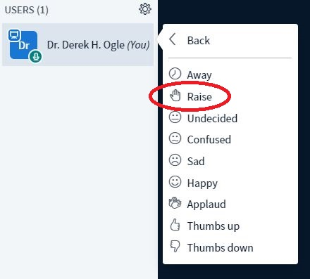

The following are suggestions for making the synchronous video sessions run more smoothly.

* The software that we will use consistently works with the Chrome browser. Thus, please interact with the chrome browser through Chrome. [Chrome may be downloaded here](https://www.google.com/chrome/){:target="_blank"}.
* Links to the [online meetings are here](https://mycourses.northland.edu/ICS/Academics/MTH/MTH__250/2019_30-MTH__250-01/Online_Meetings.jnz). Simply choose the link for the particular session.

* When we first start class you can share your video. Whether you do or not is completely up to you; though I like to see everybody's faces to start a class period. Once I start the lecture then please don't share your video to improve performance and reduce distractions.
* After I start the lecture, please mute your audio to reduce unwanted noises being shared with others.
* When not "chat"ting you can minimize the Public Chat box to maximize the amount of screen available for the slides.
* Please minimize use of the chat except to answer questions or get my attention if I miss that you have "raised your hand.""

* If you have a question please "raise your hand" or ask a question through the "Public Chat" option (though I may miss activity on the chat).

* More hints on using the on-line meeting software can be found [in this video](https://youtu.be/uYYnryIM0Uw){:target="_blank"}.