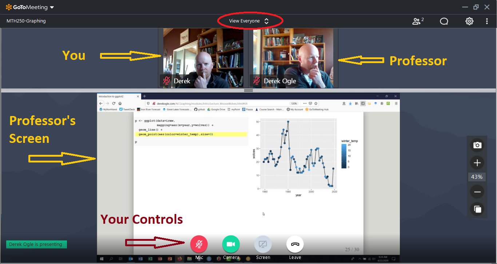
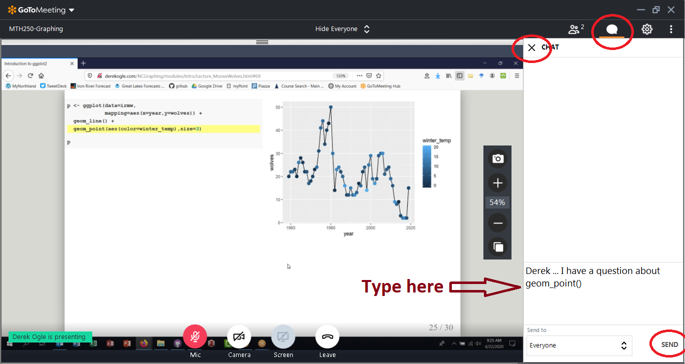
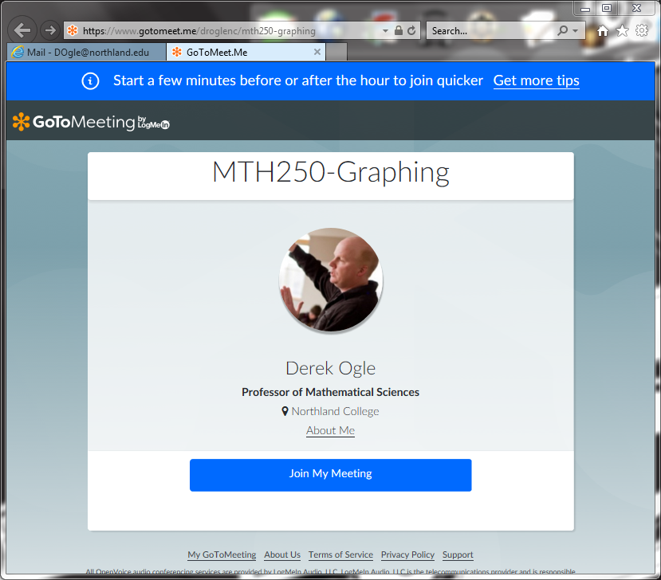
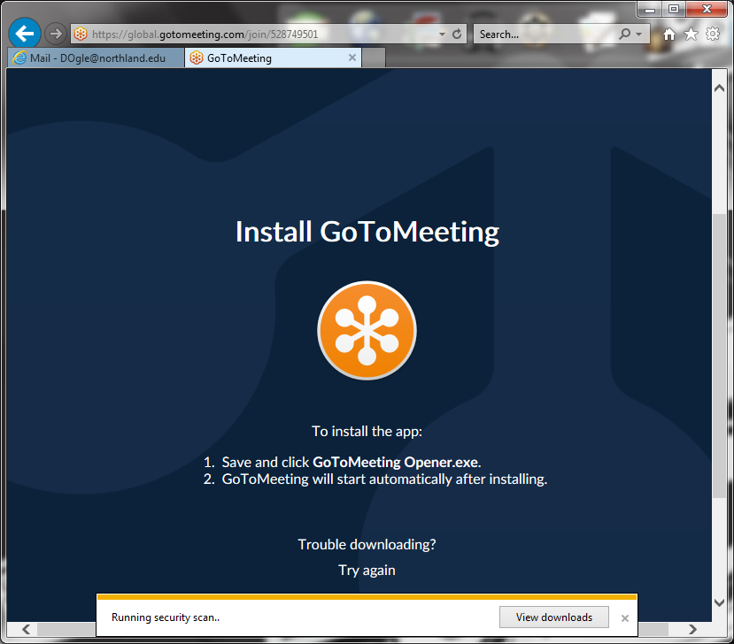
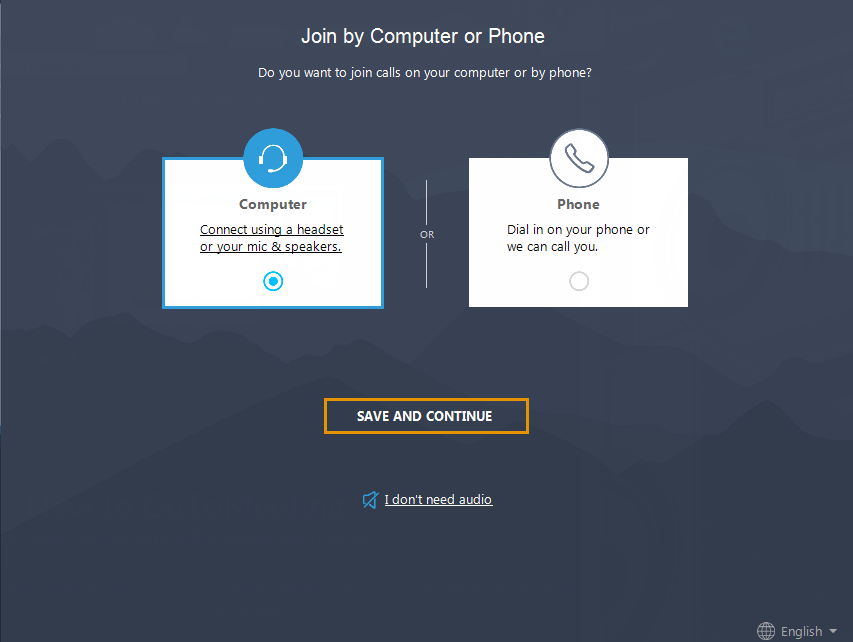
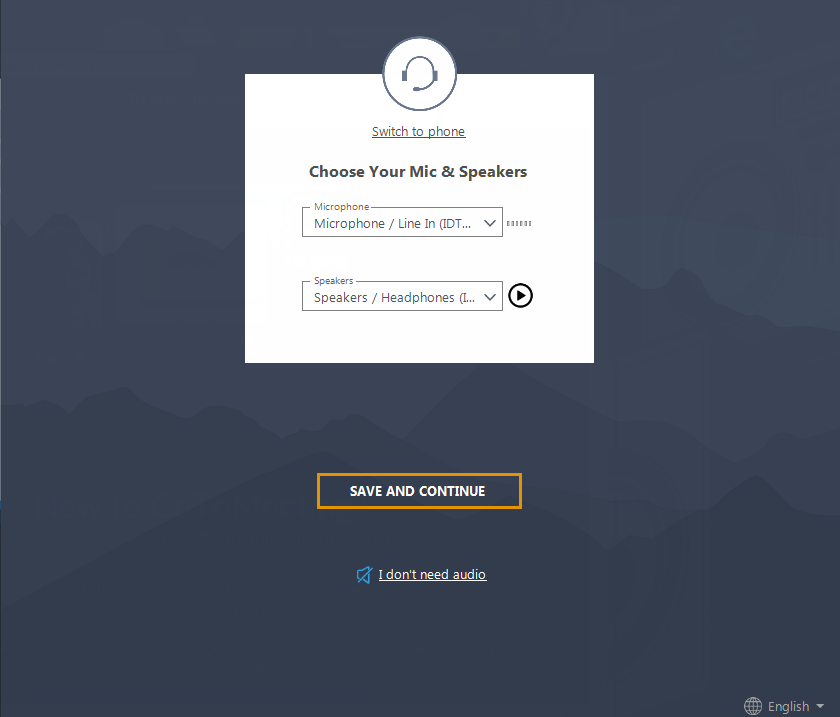
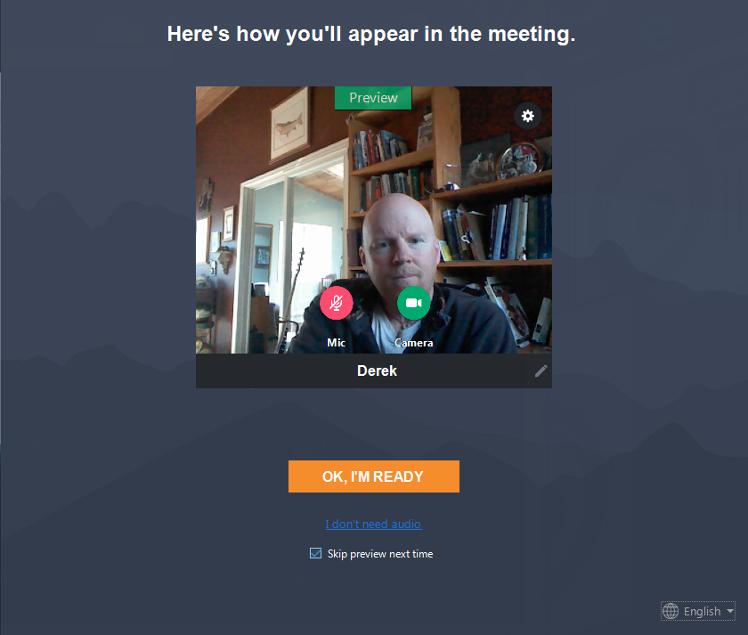
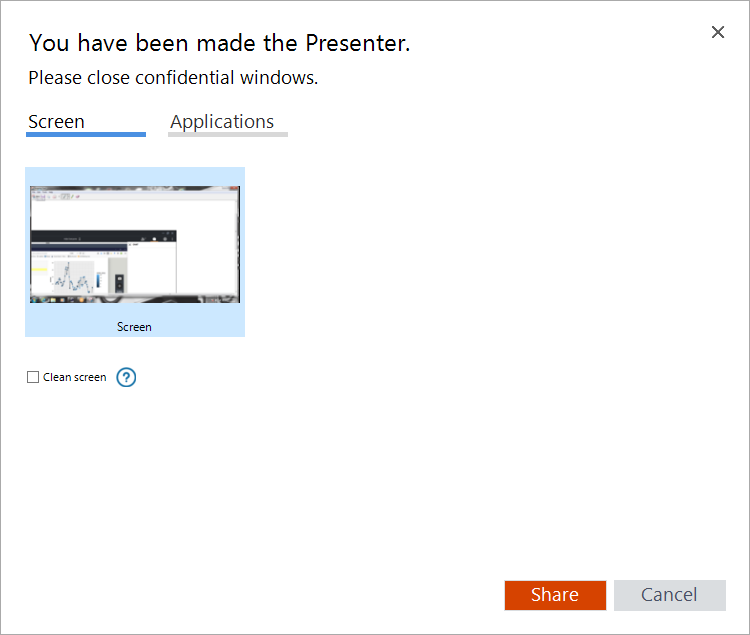
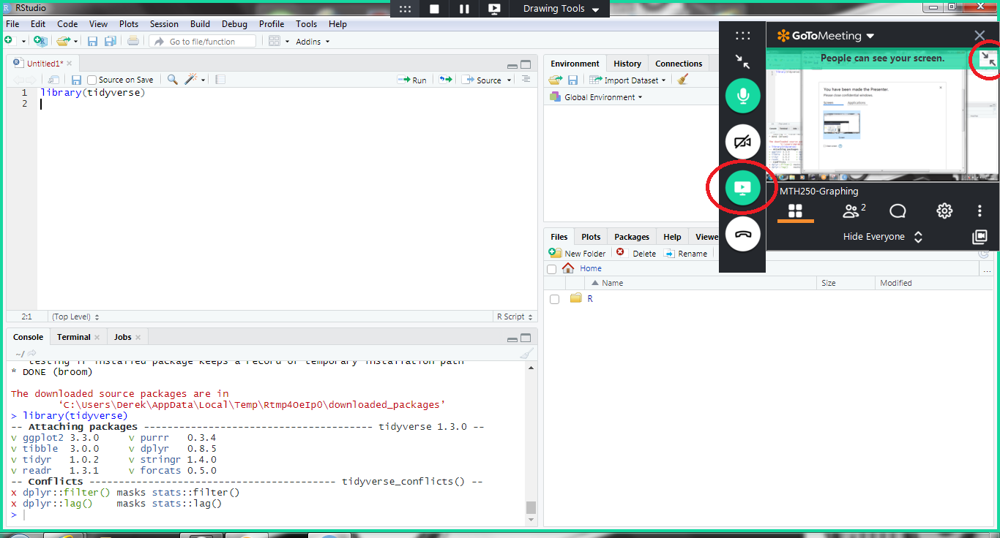

We will use the GoToMeeting app for our online lectures this term. A consistent link to the [online meeting space is here](https://www.gotomeet.me/droglenc/mth250-graphing) (which is also on the [Resources page](index). Links below are to specific suggestions or directions for using this app.

* [General Suggestions](#general-suggestions)
* [Initial Installation of the App](#initial-installation-of-the-app)
* [Sharing Your Screen with Me](#sharing-your-screen-with-me)

&nbsp;

## General Suggestions

The following are suggestions for making the synchronous video sessions run smoothly.

* To minimize unwanted noise and distraction, please mute your microphone when not speaking. To mute and unmute yourself move your cursor over the bottom middle portion of the GoToMeeting screen and four circular buttons will appear (see below). Press the left-most butto to mute an unmute the microphone (in the screen below the microphone button is red and thus you are muted).

* Whether you share your webcam or not is completely up to you; though I like to see everybody's face to start a class period. To share and unshare your webcam you can press the camera icon shown in the screen above (in this screen the camera icon is green so your camera is being shown to those in the meeting).

* During lecture you may want to hide all of the cameras so that my presentation is larger. To do this change the "View Everyone" item in the top middle of the screen above to "Hide Everyone". You can, of course, change this back if you want to see others (e.g., when we are having a discussion).

* You can ask questions of me by simply unmuting your microphone and interrupting me (**don't hesitate**) or typing your question in the chat box. You can open the chat box (see below) by selecting the small "quotation bubble" in the upper-right corner. You likely want to close the chat window after using it to maximize space for the presentation.

* You can leave the meeting by pressing the "Leave" button in your controls.

&nbsp;

## Initial Installation of the App

To join a GoToMeeting you will nee to install the GoToMeeting app. The process is pretty straightforward, but I provide directions below. Steps 2 and 3 below should only have to be completed once (per computer that you use).

* You will see the following screen when you try to joing the class meeting.

* You will be prompted to download the app.

* And then directed on how to run the installer.

* Once the app is installed you will be asked how you want to join. Please select "computer" if have that option. Then select "SAVE AND CONTINUE".

* You can select which microphone and speakers to use. Then select "SAVE AND CONTINUE".

* Finally you will be given a preview of how you will appear. You can test your "audio" below the "OK, I'M READY" button and you can also select the option below that to skip this previous when entering future meetings. You can turn on (or off) your microphone or your camera in the preview window. When ready, press "OK, I'M READY" and you will be entered into the meeting (and your screen will look similar to the first screen in the previous section).

&nbsp;

## Sharing Your Screen with Me
You are unlikely to share your screen during a class period. However, this is very handy in one-on-one question-answer sesssions as it will allow me to see what **you** are doing on **your** computer. Below are directions on how to share your computer with me during a meeting.

* I need to make you "a presenter." When I do so, you will see the screen below. At this time you should close windows or applications on your computer that you do not want to share. Once you have done that you can share your entire screen (as shown in the screen below) or a particular application (switch to the "Applications" tab). I find it easier to just share the screen in case you need to go back-and-forth between apps on your computer (e.g., RStudio and the course webpage). When you are ready, press "Share."

* When in presenter mode, your screen will look like that below. A small GoToMeeting app will appear in the upper-right where you will have the same controls as usual. Note however that the screen icon is now green (as you are sharing your screen) and you probably want to have your microphone on (you are likely explaining something to me). You can declutter your screen some by "Hide Everyone" and minimize the small window showing what your screen looks like to others. When you are done showing your screen simply press the "Screen" button (it will change from being green).

