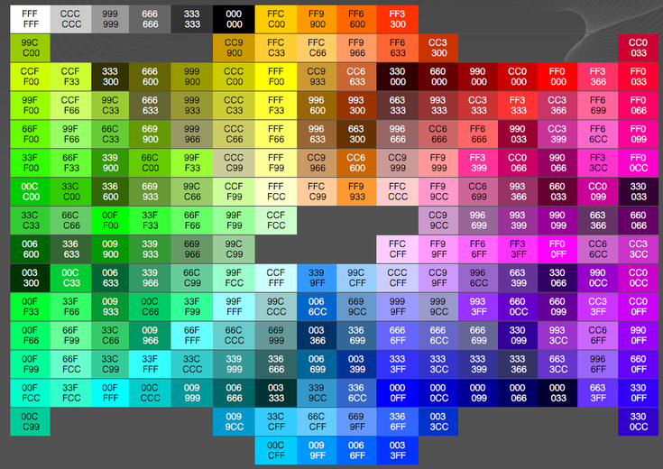

Generally speaking you should not spend time choosing your own color palette as there are many resources for choosing palettes of colors that "work well together" (under a variety of criteria). In R, colors may be chosen individually or as part of a larger palette. We will [discuss colors more in this module](../modules/Themes.html).

----

## Choosing Individual Colors
### Named Colors
You can choose one of the 657 named colors in R (e.g., `color="orange4"`).


<font size="7">from <a href="https://greggilbertlab.sites.ucsc.edu/teaching/rtransition/">Greg Gilbert Lab</a></font>

### Hexadecimal Colors
You can choose a color by specifying its hexadecimal code (e.g., `color="#CC3300"`).


<font size="7">from <a href="http://www.visibone.com/">visibone.com</a></font>

----

## Choosing Colors in a Palette

Two simple color-blind-friendly palettes are shown below, with R code to produce a vector with the colors (this is from [cookbook-r](http://www.cookbook-r.com/Graphs/Colors_(ggplot2)/)).


```
# The palette with grey:
cbPalette <- c("#999999","#E69F00","#56B4E9","#009E73",
               "#F0E442","#0072B2","#D55E00","#CC79A7")
```


```
# The palette with black:
cbbPalette <- c("#000000", "#E69F00", "#56B4E9", "#009E73", "#F0E442", "#0072B2", "#D55E00", "#CC79A7")
```

Other sources of palettes are listed below:

* [Paletteer Gallery](https://github.com/PMassicotte/paletteer_gallery): Gallery of palettes built into R and R packages.
* [Colorspace package in R](): An R toolbox for manipulating and assessing colors and palettes (related to the HCL Wizard site that is next).
* [HCL Wizard](http://hclwizard.org/): Software to develop palettes and emulate what a graph would look like to multiple types of color deficiency (i.e,. color-blindness).
* [ColorBrewer 2.0](https://colorbrewer2.org/#type=sequential&scheme=BuGn&n=3): A classic method of choosing a palette.
* [Color Pallette Generator](https://mycolor.space/?hex=%23C25EB0&sub=1): Generates a color palette from one user-provided color.
* [Color Thief](https://lokeshdhakar.com/projects/color-thief/): Software to generate a palette from an image.
* [Color Calculator](https://www.sessions.edu/color-calculator/): Generate color scheme by choosing base colors and a "harmony."
