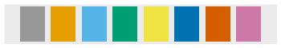

Generally speaking you should not spend time choosing your own color palette as there are many resources for choosing palettes of colors that "work well together" (under a variety of criteria). In R, colors may be chosen individually or as part of a larger palette. We will [discuss colors more in this module](../modules/Themes.html).

----

## Choosing Individual Colors
### Named Colors
You can choose one of the 657 named colors in R (e.g., `color="orange4"`).


<font size="2">from <a href="https://greggilbertlab.sites.ucsc.edu/teaching/rtransition/" target="_blank">Greg Gilbert Lab</a></font>

### Hexadecimal Colors
You can choose a color by specifying its hexadecimal code (e.g., `color="#CC3300"`). Here is [a more comprehensive showing of colors by hexadecimal code](https://www.pagetutor.com/hosted_sample1/bgcolors1536.html){:target="_blank"}.


<font size="2">from <a href="http://www.visibone.com/" target="_blank">visibone.com</a></font>

----

## Choosing Colors as a Palette

Two simple color-blind-friendly palettes are shown below, with R code to produce a vector with the colors (from [cookbook-r](http://www.cookbook-r.com/Graphs/Colors_(ggplot2)/){:target="_blank"}).



```
# The palette with grey:
cbPalette <- c("#999999","#E69F00","#56B4E9","#009E73",
               "#F0E442","#0072B2","#D55E00","#CC79A7")
```


```
# The palette with black:
cbbPalette <- c("#000000","#E69F00","#56B4E9","#009E73",
                "#F0E442","#0072B2","#D55E00","#CC79A7")
```

Other sources of palettes are listed below:

* [Paletteer Gallery](https://github.com/PMassicotte/paletteer_gallery){:target="_blank"}: Gallery of palettes built into R and R packages.
* [Colorspace package in R](http://colorspace.r-forge.r-project.org/){:target="_blank"}: An R toolbox for manipulating and assessing colors and palettes. [A demonstration for using directly in R](https://cran.r-project.org/web/packages/colorspace/vignettes/colorspace.html){:target="_blank"}.
* [HCL Wizard](http://hclwizard.org/){:target="_blank"}: Software to develop palettes and emulate what a graph would look like to multiple types of color deficiency (i.e,. color-blindness).
* [ColorBrewer 2.0](https://colorbrewer2.org/){:target="_blank"}: A classic method of choosing a palette.
* [Color Pallette Generator](https://mycolor.space/?hex=%23C25EB0&sub=1){:target="_blank"}: Generates a color palette from one user-provided color.
* [Color Thief](https://lokeshdhakar.com/projects/color-thief/){:target="_blank"}: Software to generate a palette from an image.
* [Color Calculator](https://www.sessions.edu/color-calculator/){:target="_blank"}: Generate color scheme by choosing base colors and a "harmony."
